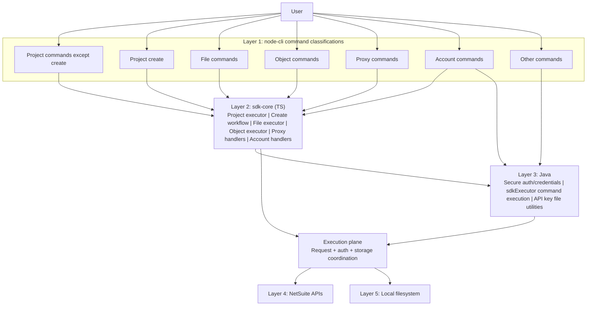

# SuiteCloud CLI Layered Command Flow

```mermaid
flowchart TB
    U[User]

    subgraph L1["Layer 1: node-cli command classifications"]
      direction TB
      C_PROJECT[Project commands except create]
      C_CREATE[Project create]
      C_FILE[File commands]
      C_OBJECT[Object commands]
      C_PROXY[Proxy commands]
      C_ACCOUNT[Account commands]
      C_OTHER[Other commands]
    end

    S["Layer 2: sdk-core (TS)
Project executor | Create workflow | File executor | Object executor | Proxy handlers | Account handlers"]
    J["Layer 3: Java
Secure auth/credentials | sdkExecutor command execution | API key file utilities"]
    X["Execution plane
Request + auth + storage coordination"]
    A["Layer 4: NetSuite APIs"]
    F["Layer 5: Local filesystem"]

    U --> C_PROJECT
    U --> C_CREATE
    U --> C_FILE
    U --> C_OBJECT
    U --> C_PROXY
    U --> C_ACCOUNT
    U --> C_OTHER

    C_PROJECT --> S
    C_CREATE --> S
    C_FILE --> S
    C_OBJECT --> S
    C_PROXY --> S
    C_ACCOUNT --> S
    C_ACCOUNT --> J
    C_OTHER --> J

    S --> J
    S --> X
    J --> X
    X --> A
    X --> F
```
