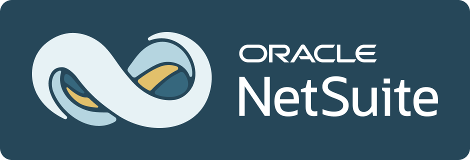

<p align="left"><a href="#"></a></p>

# SuiteCloud Agent Skills
SuiteCloud Agent Skills is a platform-agnostic skill collection for coding assistants, built to be compatible with the [agentskills.io specification](https://agentskills.io/specification).

These skills are focused on SuiteCloud and NetSuite development workflows, including SuiteScript, SDF, UIF SPA components, security, documentation, and deployment best practices.

## What This Folder Contains
This directory includes reusable skills that can be used across different coding agents (for example, Codex, Claude Code, and Cline).

Each skill is self-contained and follows a consistent structure so agents can discover, load, and use it reliably.

### Included Skills
- [netsuite-ai-connector-instructions](./netsuite-ai-connector-instructions/SKILL.md): Provides guardrails and domain guidance for AI-to-NetSuite sessions—enforcing correct tool selection, safe SuiteQL usage, consistent output formatting, and proper multi-subsidiary and currency handling through the NetSuite AI Service Connector.
- [netsuite-sdf-roles-and-permissions](./netsuite-sdf-roles-and-permissions/SKILL.md): Helps generate and review SDF permission configurations (for example, customrole XML and script deployment permissions) and validates permission IDs/levels using NetSuite reference data.
- [netsuite-uif-spa-reference](./netsuite-uif-spa-reference/SKILL.md): Helps build, modify, and debug NetSuite UIF SPA components by providing API/type lookup for @uif-js/core and @uif-js/component (constructors, methods, props, enums, hooks, and component options).
 
## Skill Structure
Each skill lives in its own folder and includes:

- `SKILL.md` – Required metadata plus instructions
- `references/` – Optional reference docs, type definitions, and lookup data
- `scripts/` – Optional helper scripts
- `assets/` – Optional templates or static files

## Installation
Install the skills package globally. This is a CLI for the open agents skills ecosystem.
```
npm i skills -g
```

Preview available skills (without installing):
```
npx skills add oracle/netsuite-suitecloud-sdk --list
```

Install a specific skill (recommended) for a specific agent (for example, Codex) in a project or globally:
```
npx skills add oracle/netsuite-suitecloud-sdk --skill netsuite-uif-spa-reference -a codex
```
```
npx skills add oracle/netsuite-suitecloud-sdk --skill netsuite-uif-spa-reference -a codex -g
```

Install all skills (in a project or globally):
```
npx skills add oracle/netsuite-suitecloud-sdk
npx skills add oracle/netsuite-suitecloud-sdk -g
```

List the installed skills (in a project or globally):
```
npx skills ls
npx skills ls -g
```

Update skills:
If you installed the skills, you can check for updates from the recorded source and update from the same source:
```
npx skills check
npx skills update
```

Remove a skill:
```
npx skills remove netsuite-uif-spa-reference
npx skills remove netsuite-uif-spa-reference -a codex
```

## How to Use the Skills
After installing a skill for Codex (`-a codex`), reference it directly in your prompt.

Prompt pattern:
```
Use $<skill-name> to <task>.
```

Example:
```
Use $netsuite-uif-spa-reference to build a UIF SPA component with a data table and filters.
```

**Tip:** Include the exact skill name and your project context (goal, files, constraints) so Codex can apply the skill effectively.


## Design Principles
- Platform agnostic by default
- Spec-aligned metadata and structure
- Minimal assumptions about agent-specific tools
- Reusable reference data kept local for deterministic behavior

## Compatibility
These skills are intended to work across multiple agent runtimes that support agentskills.io-compatible skill loading.

## Authoring Guidelines
When adding or updating a skill:

1. Name your skill with the `netsuite` prefix: it must start with `netsuite` (lowercase), then `-` or `_`, then a short descriptive name. For example, `netsuite-create-invoice`.
2. Keep frontmatter valid and concise.
3. Stay compliant with the [agentskills.io specification](https://agentskills.io/specification).
4. Write tool-agnostic instructions.
5. Prefer local reference files over remote URLs for reproducibility.

## Contributing
This project welcomes contributions from the community. Before submitting a pull request, review our [contribution guide](./CONTRIBUTING.md).

## [License](../../LICENSE.txt)
Copyright (c) 2019, 2023 Oracle and/or its affiliates The Universal Permissive License (UPL), Version 1.0.