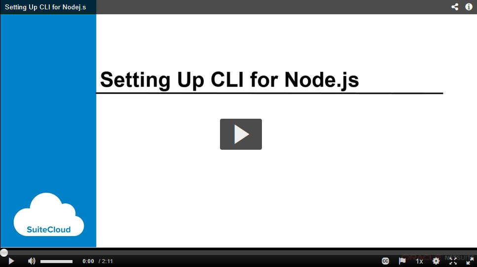

<p align="center"><a href="#"></a></p>

# SuiteCloud CLI for Node.js
<p>
  <a href="https://www.npmjs.com/package/@oracle/suitecloud-cli">
    
    
  </a>
</p>

SuiteCloud Command Line Interface (CLI) for Node.js is a SuiteCloud SDK tool to manage SuiteCloud project components and validate and deploy projects to your account.\
CLI for Node.js is an interactive tool that guides you through all the steps of the communication between your local project and your account.

## Prerequisites
The following software is required to work with SuiteCloud CLI for Node.js:
- Node.js version 14.16.0 LTS
- Oracle JDK version 11

Read the full list of prerequisites in [NetSuite's Help Center](https://system.netsuite.com/app/help/helpcenter.nl?fid=section_1558708810.html).

## Supported Versions
Although you may have access to older versions of CLI for Node.js, only the versions in this section are officially supported.

Each version of CLI for Node.js in NPM works optimally with a specific NetSuite version. To check the equivalence among versions, see the following table:

| Version in NPM | Version in NetSuite |
|:--------------:|:-------------------:|
| 1.4.X  | 2022.1   |
| 1.3.X  | 2021.2   |

## Installation
Since CLI for Node.js is a development tool, use a global instance to install it by running the following command:

```
npm install -g @oracle/suitecloud-cli
```
When installing the SuiteCloud CLI for Node.js via script, for instance in a CI environment, you can skip the license prompt presented during the normal installation process by adding the --acceptSuiteCloudSDKLicensePrompt flag to the install script as shown below. Note that by adding the mentioned flag to the script, you confirm that you have read and accepted the Oracle Free Use Terms and Conditions license. See the [License](#license) section for details.

```
npm install -g --acceptSuiteCloudSDKLicensePrompt @oracle/suitecloud-cli
```


CLI for Node.js is available from within any directory by running `suitecloud`.

## Usage
CLI for Node.js uses the following syntax: 
```
suitecloud <command> <option> <argument>
```

### Commands
| Command | Description |
| --- | --- |
|[`account:manageauth`](https://system.netsuite.com/app/help/helpcenter.nl?fid=section_157304934116.html)|Manages authentication IDs (authid) for all your projects.|
|[`account:savetoken`](https://system.netsuite.com/app/help/helpcenter.nl?fid=section_159350785187.html)|Saves a TBA token that you issued previously in NetSuite.|
|[`account:setup`](https://system.netsuite.com/app/help/helpcenter.nl?fid=section_156044528841.html)|Sets up an account to use with the SuiteCloud CLI for Node.js.|
|[`file:create`](https://system.netsuite.com/app/help/helpcenter.nl?fid=section_162810635242.html)|Creates SuiteScript files in the selected folder using the correct template with SuiteScript modules injected.|
|[`file:import`](https://system.netsuite.com/app/help/helpcenter.nl?fid=section_156041963273.html)|Imports files from an account to your account customization project.|
|[`file:list`](https://system.netsuite.com/app/help/helpcenter.nl?fid=section_156042966488.html)|Lists the files in the File Cabinet of your account.|
|[`file:upload`](https://system.netsuite.com/app/help/helpcenter.nl?fid=section_159066070687.html)|Uploads files from your project to an account.|
|[`object:import`](https://system.netsuite.com/app/help/helpcenter.nl?fid=section_156042181820.html)|Imports custom objects from an account to your SuiteCloud project.|
|[`object:list`](https://system.netsuite.com/app/help/helpcenter.nl?fid=section_156043303237.html)|Lists the custom objects deployed in an account.|
|[`object:update`](https://system.netsuite.com/app/help/helpcenter.nl?fid=section_156050566547.html)|Overwrites the custom objects in the project with the custom objects from an account. In the case of custom records, custom instances can be included.|
|[`project:adddependencies`](https://system.netsuite.com/app/help/helpcenter.nl?fid=section_155981452469.html)| Adds missing dependencies to the manifest file.|
|[`project:create`](https://system.netsuite.com/app/help/helpcenter.nl?fid=section_156041348327.html)|Creates a SuiteCloud project, either a SuiteApp or an account customization project (ACP).|
|[`project:deploy`](https://system.netsuite.com/app/help/helpcenter.nl?fid=section_156044636320.html)|Deploys the folder containing the project.|
|[`project:package`](https://system.netsuite.com/app/help/helpcenter.nl?fid=section_159550971388.html)|Generates a ZIP file from your project, respecting the structure specified in the deploy.xml file.|
|[`project:validate`](https://system.netsuite.com/app/help/helpcenter.nl?fid=section_156049843194.html)|Validates the folder containing the SuiteCloud project.|

To check the help for a specific command, run the following command:
```
suitecloud {command} -h
```

Read the detailed documentation for all the commands in [NetSuite's Help Center](https://system.netsuite.com/app/help/helpcenter.nl?fid=chapter_155931263126.html).

## Getting Started
🎞 To see how to install and set up CLI for Node.js, watch the following video:

<a href="https://videohub.oracle.com/media/Setting+Up+CLI+for+Nodej.s/0_091fc2ca"></a>


Create a new project in an empty folder by running the following command:
```
suitecloud project:create -i
```

After you create a project, configure a NetSuite account, by running the following command within the project folder:
```
suitecloud account:setup
```

## Release Notes & Documentation
To read the 2022.1 NetSuite's release notes and documentation, check the following sections of NetSuite's Help Center:
- Read the latest updates under SuiteCloud SDK in the [Help Center Weekly Updates](https://system.netsuite.com/app/help/helpcenter.nl?fid=chapter_3798389663.html).
- Read the release notes for NetSuite 2022.1 in [Release Notes](https://system.netsuite.com/app/help/helpcenter.nl?fid=preface_3710624702.html).
- Read the CLI for Node.js documentation in [NetSuite's Help Center](https://system.netsuite.com/app/help/helpcenter.nl?fid=chapter_1558708800.html).

## [Contributing](/CONTRIBUTING.md)
SuiteCloud CLI for Node.js is an open source project. Pull Requests are currently not being accepted. See [Contributing](/CONTRIBUTING.md) for details.

## [License](/LICENSE.txt)
Copyright (c) 2022 Oracle and/or its affiliates The Universal Permissive License (UPL), Version 1.0.

By installing the SuiteCloud CLI for Node.js, you are accepting the installation of the SuiteCloud SDK dependency under the [Oracle Free Use Terms and Conditions](https://www.oracle.com/downloads/licenses/oracle-free-license.html) license.