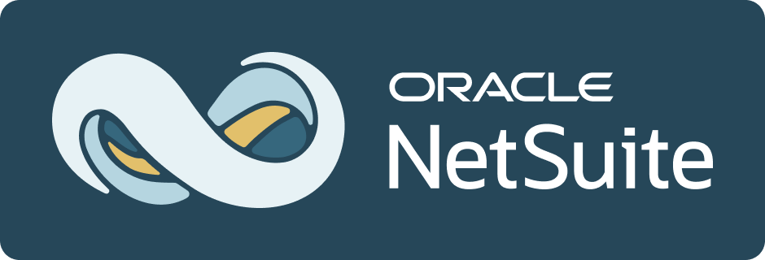
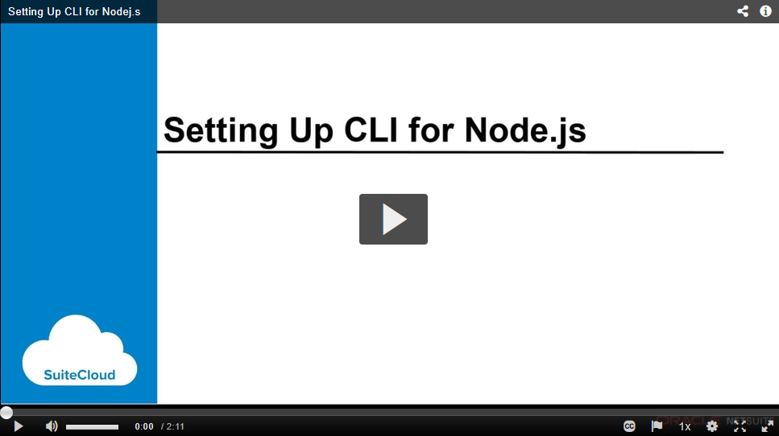

<p align="left"><a href="#"></a></p>

# SuiteCloud CLI for Node.js
<p>
  <a href="https://www.npmjs.com/package/@oracle/suitecloud-cli">
    
    
  </a>
</p>

SuiteCloud Command Line Interface (CLI) for Node.js is a SuiteCloud SDK tool to manage SuiteCloud project components and validate and deploy projects to your account.\
CLI for Node.js is an interactive tool that guides you through all the steps of the communication between your local project and your account.

## Prerequisites
The following software is required to work with SuiteCloud CLI for Node.js:
- Node.js version 22 LTS
- Oracle JDK version 17 or 21

Read the full list of prerequisites in [SuiteCloud CLI for Node.js Installation Prerequisites](https://docs.oracle.com/en/cloud/saas/netsuite/ns-online-help/section_1558708810.html).

## Supported Versions
To ensure that you get the latest features and bug fixes, you should use the latest version of the SuiteCloud CLI for Node.js available in NPM. 

The following table shows the CLI versions currently available in NPM.

| CLI Versions Available in NPM | 
|:-----------------------------:|
| 3.2.0 |
| 3.1.4 |


## Installation
Since CLI for Node.js is a development tool, use a global instance to install it by running the following command:

```
npm install -g @oracle/suitecloud-cli
```
When you install SuiteCloud CLI for Node.js through a script, such as in a CI environment, set the `SUITECLOUD_CLI_ACCEPT_LICENSE` environment variable to `true` to suppress the license prompt. By setting this variable, you confirm that you have read and accepted the Oracle Free Use Terms and Conditions. For details, see the [License](#license) section.

```
SUITECLOUD_CLI_ACCEPT_LICENSE=true npm install -g @oracle/suitecloud-cli
```

If you use PowerShell, run:

```
$env:SUITECLOUD_CLI_ACCEPT_LICENSE = 'true'
npm install -g @oracle/suitecloud-cli
```


CLI for Node.js is available from within any directory by running `suitecloud`.

## Usage
CLI for Node.js uses the following syntax: 
```
suitecloud <command> <option> <argument>
```

### Building executables for Windows, macOS, and Linux

Use Node.js 22 and install dependencies from the repository root with `npm ci`.
Pin the exact Node patch version on your CI agents for repeatable releases.
The builder embeds that same version for every target; users do not need Node installed.

Build all default targets from one agent (Linux, Windows, or macOS):

```sh
npm run build:exe:all
```

| Target | Output |
| --- | --- |
| Windows x64 | `packages/node-cli/dist/win32-x64/suitecloud.exe` |
| macOS Apple Silicon | `packages/node-cli/dist/darwin-arm64/suitecloud` |
| Linux x64 | `packages/node-cli/dist/linux-x64/suitecloud` |

Select one target or a comma-separated list:

```sh
npm run build:exe -- win32-x64
npm run build:exe -- linux-x64,linux-arm64,darwin-arm64
```

Supported targets are `win32-x64`, `win32-arm64`, `darwin-arm64`,
`linux-x64`, and `linux-arm64`. The aliases `windows`, `mac`, and `macos`
are accepted. Intel Mac (`darwin-x64`) SEA builds are not included.
Without arguments, `npm run build:exe` preserves the native build behavior and writes
`packages/node-cli/dist/suitecloud.exe` on Windows or `dist/suitecloud` elsewhere.

Each build compiles SDK core and bundles the CLI once, then generates a SEA blob with
snapshots and code caching disabled. For foreign targets, the builder downloads the
matching official Node release from `https://nodejs.org/download/release/`, verifies
its SHA-256 against that release's `SHASUMS256.txt`, and injects the blob using postject.
The agent needs HTTPS access to nodejs.org and `tar` on PATH to extract Linux/macOS runtimes.
The build uses Node 22's `--experimental-sea-config` workflow, not `--build-sea` from newer Node releases.

#### TeamCity on Unix/Linux

After your normal dependency installation step, run `npm run build:exe:all` in the
repository root. Publish these artifact paths:

```text
packages/node-cli/dist/win32-x64/suitecloud.exe
packages/node-cli/dist/darwin-arm64/suitecloud
packages/node-cli/dist/linux-x64/suitecloud
```

The macOS artifact built on Linux or Windows is **unsigned** and needs a follow-up
signing step on a Mac before execution/distribution. The build logs this requirement.
For local testing, after transferring the artifact to a Mac:

```sh
chmod +x suitecloud
codesign --force --sign - suitecloud
./suitecloud --help
```

When built on a Mac, the builder applies an ad-hoc signature automatically. For public
distribution, use your organization's Developer ID signing and notarization process;
ad-hoc signing is only for local testing. Apply your Windows code-signing process to
the final .exe as well, since SEA injection invalidates the original Node signature.
Run smoke tests on each target OS/architecture before publishing. Linux artifacts
use official Node runtimes and target compatible glibc systems, not Alpine/musl.

Webpack cleans `dist` when bundling. Request all targets in one invocation to keep
the outputs together. To package another target without rebuilding/cleaning the bundle:

```sh
node packages/node-cli/scripts/build-sea.js linux-arm64
```

Run packaging checks with `npm run test:sea`.
Oracle JDK 17 or 21 and the downloaded SuiteCloud SDK JAR are still required for commands
that invoke the Java SDK. This change embeds Node and JavaScript, not Java or the SDK JAR.

#### Signing Windows and Linux artifacts

Install Java and the [Jsign 7.5 all-in-one JAR](https://ebourg.github.io/jsign/) for
Windows signing, and [GnuPG](https://gnupg.org/download/) for Linux detached signatures.
These tools can run on Windows, Linux, or macOS. Keep keys and keystores outside the repository.

After configuring credentials below, from the repository root:

```sh
# Sign the existing win32-x64 and linux-x64 artifacts:
npm run sign:exe
# Or build both targets and then sign them:
npm run build:exe:signed
# Select an already-built target:
npm run sign:exe -- linux-arm64
```

Windows signing replaces the signature in the final `.exe`, using SHA-256 and an
RFC 3161 timestamp. It runs after SEA injection; the earlier postject warning about
the original Node signature may still appear during building.
Linux signing preserves the executable and creates `suitecloud.asc` beside it.
Distribute both the binary and its `.asc` file. Neither command signs macOS artifacts.
Sign again after rebuilding; an older detached signature does not cover a new binary.

The signing command requires explicit credentials and fails if they are absent.
It signs temporary copies, preserving an existing output when signing that output fails.
Targets are processed sequentially, so earlier successful targets remain signed if a later one fails.

Windows environment variables:

| Variable | Value |
| --- | --- |
| `SUITECLOUD_JSIGN_JAR` | Absolute path to the downloaded Jsign JAR |
| `SUITECLOUD_SIGN_KEYSTORE` | Keystore path or Jsign signing-service keystore identifier |
| `SUITECLOUD_SIGN_ALIAS` | Certificate/key alias |
| `SUITECLOUD_SIGN_TSA_URL` | Your provider's RFC 3161 timestamp URL |
| `SUITECLOUD_SIGN_STORETYPE` | Optional Jsign store type, such as `PKCS12` or `PKCS11` |
| `SUITECLOUD_SIGN_CERTFILE` | Optional certificate-chain file for providers that require it |
| `SUITECLOUD_SIGN_STOREPASS` | Keystore password/token, supplied securely through the environment |
| `SUITECLOUD_SIGN_KEYPASS` | Optional separate key password |
| `SUITECLOUD_JAVA` | Optional Java executable path; defaults to `java` |

Password values are passed through Jsign's `env:` references, not embedded in process arguments.
Signing services and hardware keys also require their provider-specific setup.
For production Windows releases, obtain your organization's code-signing identity or use a
trusted code-signing provider. A self-signed certificate does not create a trusted Windows publisher.
Validate release signatures on Windows with `signtool verify /pa /v suitecloud.exe`.
Jsign 7.5 does not provide the `verify` subcommand documented for the 8.0 preview.

To create a **local-test-only** Windows signing certificate using the JDK, run this
in a private directory outside the checkout. It prompts for a keystore password:

```sh
keytool -genkeypair -alias suitecloud-test -keyalg RSA -keysize 3072 -sigalg SHA256withRSA -storetype PKCS12 -keystore suitecloud-test.p12 -dname "CN=SuiteCloud Local Test" -validity 30 -ext KU=digitalSignature -ext EKU=codeSigning
```

Use the absolute `.p12` path as `SUITECLOUD_SIGN_KEYSTORE`, `suitecloud-test` as the
alias, and the chosen password as `SUITECLOUD_SIGN_STOREPASS`. This certificate is
not automatically trusted on this or other computers; do not use it for public releases.
See the [JDK keytool reference](https://docs.oracle.com/en/java/javase/21/docs/specs/man/keytool.html).

For Linux, create a signing key interactively with GnuPG:

```sh
gpg --full-generate-key
gpg --list-secret-keys --keyid-format LONG
```

Choose a signing-capable key, your release identity, an expiry date, and a strong passphrase.
Set `SUITECLOUD_GPG_KEY` to the full fingerprint shown (without spaces).
The script uses GPG's agent/pinentry for unlocking protected keys; unattended runs
need a provisioned agent or hardware token. It does not store a GPG passphrase.
`SUITECLOUD_GPG` optionally specifies the GPG executable path. `GNUPGHOME` is honored normally.

Export only your public key for recipients, replacing `YOUR_FULL_FINGERPRINT`:

```sh
gpg --armor --output suitecloud-signing-public.asc --export YOUR_FULL_FINGERPRINT
```

Recipients should confirm that fingerprint through a trusted channel, then verify:

```sh
gpg --import suitecloud-signing-public.asc
gpg --verify suitecloud.asc suitecloud
```

On PowerShell, configure variables using `$env:SUITECLOUD_GPG_KEY = 'YOUR_FULL_FINGERPRINT'`;
on Linux/macOS shells use `export SUITECLOUD_GPG_KEY='YOUR_FULL_FINGERPRINT'`.
Use the same syntax for the Windows signing variables, substituting the appropriate names.

Run signing orchestration tests with `npm run test:signing`. These use test doubles;
actual certificate trust and signing-tool integration must be verified with configured credentials.

### Commands
| Command | Description |
| --- | --- |
|[`account:manageauth`](https://docs.oracle.com/en/cloud/saas/netsuite/ns-online-help/section_157304934116.html)|Manages authentication IDs for all your projects.|
|[`account:setup`](https://docs.oracle.com/en/cloud/saas/netsuite/ns-online-help/article_89132630266.html)|Sets up an account to use with SuiteCloud SDK and configures the default auth ID for the SuiteCloud project. It requires browser-based login to NetSuite.|
|[`account:setup:ci`](https://docs.oracle.com/en/cloud/saas/netsuite/ns-online-help/article_81134826821.html)|Sets up an account to use with SuiteCloud SDK and configures the default auth ID for the SuiteCloud project. It also allows you to select an existing auth ID for the SuiteCloud project. This command does not require browser-based login to NetSuite and is helpful for automated environments such as CI.|
|[`file:create`](https://docs.oracle.com/en/cloud/saas/netsuite/ns-online-help/section_162810635242.html)|Creates SuiteScript files in the selected folder using the correct template with SuiteScript modules injected.|
|[`file:import`](https://docs.oracle.com/en/cloud/saas/netsuite/ns-online-help/section_156041963273.html)|Imports files from an account to your account customization project.|
|[`config:import`](https://docs.oracle.com/en/cloud/saas/netsuite/ns-online-help/section_1500042748.html)|Imports all features from an account to the current account customization project.|
|[`file:list`](https://docs.oracle.com/en/cloud/saas/netsuite/ns-online-help/section_156042966488.html)|Lists the files in the File Cabinet of your account.|
|[`file:upload`](https://docs.oracle.com/en/cloud/saas/netsuite/ns-online-help/section_159066070687.html)|Uploads files from your project to an account.|
|[`object:import`](https://docs.oracle.com/en/cloud/saas/netsuite/ns-online-help/section_156042181820.html)|Imports SDF custom objects from an account to your SuiteCloud project.|
|[`object:list`](https://docs.oracle.com/en/cloud/saas/netsuite/ns-online-help/section_156043303237.html)|Lists the SDF custom objects deployed in an account.|
|[`object:update`](https://docs.oracle.com/en/cloud/saas/netsuite/ns-online-help/section_156050566547.html)|Overwrites the SDF custom objects in the project with their matching objects imported from the account. In the case of custom records, custom instances can be included.|
|[`project:adddependencies`](https://docs.oracle.com/en/cloud/saas/netsuite/ns-online-help/section_155981452469.html)| Adds missing dependencies to the manifest file.|
|[`project:create`](https://docs.oracle.com/en/cloud/saas/netsuite/ns-online-help/section_156041348327.html)|Creates a SuiteCloud project, either a SuiteApp or an account customization project (ACP).|
|[`project:deploy`](https://docs.oracle.com/en/cloud/saas/netsuite/ns-online-help/section_156044636320.html)|Deploys the folder containing the project.|
|[`project:package`](https://docs.oracle.com/en/cloud/saas/netsuite/ns-online-help/section_159550971388.html)|Generates a ZIP file from your project, respecting the structure specified in the deploy.xml file.|
|[`project:validate`](https://docs.oracle.com/en/cloud/saas/netsuite/ns-online-help/section_156049843194.html)|Validates the folder containing the SuiteCloud project.|
|[`proxy:generatekey`](https://docs.oracle.com/en/cloud/saas/netsuite/ns-online-help/article_26100955155.html)|Generates a new API key for proxy authentication.|
|[`proxy:start`](https://docs.oracle.com/en/cloud/saas/netsuite/ns-online-help/article_9101043487.html)|Starts a local proxy for the SuiteCloud Developer Assistant service.|

To check the help for a specific command, run the following command:
```
suitecloud {command} -h
```

Read the detailed documentation for all the commands in [SuiteCloud CLI for Node.js Reference](https://docs.oracle.com/en/cloud/saas/netsuite/ns-online-help/chapter_155931263126.html).

## Getting Started
🎞 To see how to install and set up CLI for Node.js, watch the following video:

<a href="https://videohub.oracle.com/media/Setting+Up+CLI+for+Nodej.s/0_091fc2ca"></a>


Create a new project in an empty folder by running the following command:
```
suitecloud project:create -i
```

After you create a project, configure a NetSuite account, by running the following command within the project folder:
```
suitecloud account:setup
```

## Release Notes & Documentation
To read NetSuite release notes and documentation, check the following sections of NetSuite's Help Center:
- Read the latest release notes in [SuiteCloud SDK Release Notes](https://docs.oracle.com/en/cloud/saas/netsuite/ns-online-help/section_1558730192.html).
- Read the latest updates under SuiteCloud SDK in the [Help Center Weekly Updates](https://docs.oracle.com/en/cloud/saas/netsuite/ns-online-help/chapter_3798389663.html).
- Read the CLI for Node.js documentation in [SuiteCloud CLI for Node.js Guide](https://docs.oracle.com/en/cloud/saas/netsuite/ns-online-help/chapter_1558708800.html).


## Contributing
This project welcomes contributions from the community. Before submitting a pull request, review our [contribution guide](/CONTRIBUTING.md).

## [License](/LICENSE.txt)
Copyright (c) 2019, 2023 Oracle and/or its affiliates The Universal Permissive License (UPL), Version 1.0.

By installing SuiteCloud CLI for Node.js, you are accepting the installation of the SuiteCloud SDK dependency under the [Oracle Free Use Terms and Conditions](https://www.oracle.com/downloads/licenses/oracle-free-license.html) license.
