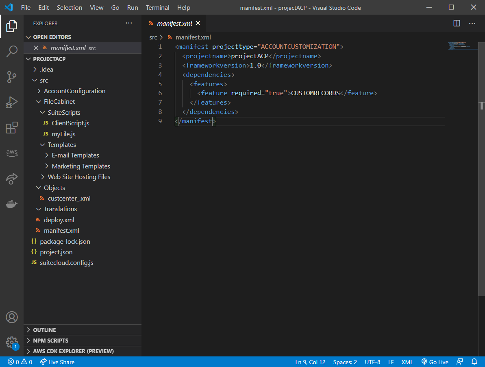
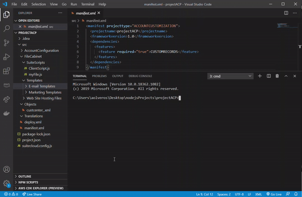

# SuiteCloud Extension for Visual Studio Code
The SuiteCloud extension allows you to customize your SuiteCloud Development Framework (SDF) projects for NetSuite.

> 💡 To read more about SDF, visit [NetSuite's Help Center.](https://system.netsuite.com/app/help/helpcenter.nl?fid=section_4702656040.html)

The following types of SDF projects are available:
- SuiteApp projects — self-contained, standalone projects that you can publish in the SuiteApp Marketplace for other users to download and install.
  > 💡 To read more about SuiteApp projects, visit [NetSuite's Help Center.](https://system.netsuite.com/app/help/helpcenter.nl?fid=subsect_1509931104.html)
- Account customization projects — intended for customizations on accounts you own, such as your production, development, and sandbox accounts.
  > 💡 To read more about account customization projects, visit [NetSuite's Help Center.](https://system.netsuite.com/app/help/helpcenter.nl?fid=subsect_1510680449.html)



SuiteCloud extension for Visual Studio Code is part of SuiteCloud Software Development Kit (SuiteCloud SDK), a set of tools to customize NetSuite accounts.

💡 To read more about SuiteCloud SDK, visit [NetSuite's Help Center.](https://system.netsuite.com/app/help/helpcenter.nl?fid=chapter_156026236161.html)

## Installation prerequisites
The following software is required to work with SuiteCloud extension for Visual Studio Code:
- Node.js version 14.16.0 LTS
- Oracle JDK version 11

Read the detailed list of prerequisites in [NetSuite's Help Center](https://system.netsuite.com/app/help/helpcenter.nl?fid=section_159223197655.html).


## SuiteCloud Extension commands
The following commands are available through the Command Palette:
- [Update Single Object with Account Object](https://system.netsuite.com/app/help/helpcenter.nl?fid=subsect_160147382361.html)
- [Upload File](https://system.netsuite.com/app/help/helpcenter.nl?fid=subsect_160147414469.html)
- [List Objects](https://system.netsuite.com/app/help/helpcenter.nl?fid=subsect_160163955513.html)
- [Setup Account](https://system.netsuite.com/app/help/helpcenter.nl?fid=section_160147609118.html)
- [Deploy Project](https://system.netsuite.com/app/help/helpcenter.nl?fid=section_160147342366.html)
- [Add Dependency References to the Manifest](https://system.netsuite.com/app/help/helpcenter.nl?fid=section_160147339580.html)

💡 To read more about what you can do with SuiteCloud extension for Visual Studio Code, visit [NetSuite's Help Center](https://system.netsuite.com/app/help/helpcenter.nl?fid=article_159223173518.html).

## SuiteCloud Extension combined with SuiteCloud CLI for Node.js
SuiteCloud CLI for Node.js is another open-source SuiteCloud SDK tool. This tool has more available commands that you can use in combination with the ones available in SuiteCloud extension for Visual Studio Code.

To work with both tools at the same time, do the following:
1. Install SuiteCloud CLI for Node.js by following the instructions [here](../node-cli/README.md).
2. Open a terminal inside of your SDF project, and enter:
   ```javascript
   suitecloud -h
   ```
3. You can now use SuiteCloud CLI for Node.js in your SDF projects while working in SuiteCloud extension for Visual Studio Code.



## [Contributing](/CONTRIBUTING.md)
SuiteCloud Extension for Visual Studio Code is an open source project. Pull Requests are currently not being accepted. See [CONTRIBUTING](/CONTRIBUTING.md) for details.

## [License](/LICENSE.txt)
Copyright (c) 2021 Oracle and/or its affiliates The Universal Permissive License (UPL), Version 1.0.