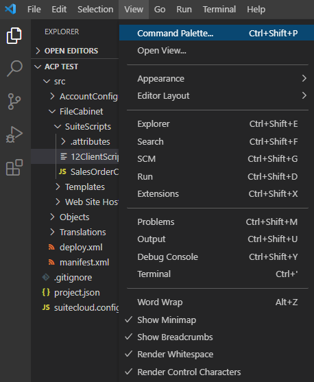
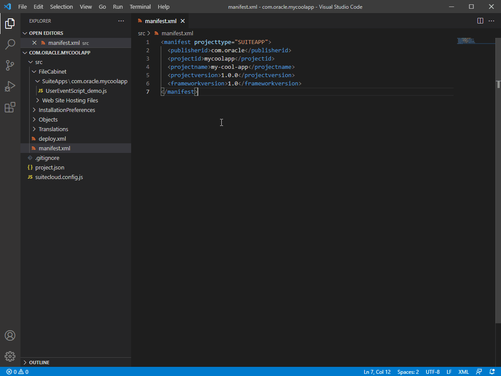

# SuiteCloud Extension for Visual Studio Code

SuiteCloud Extension for Visual Studio Code is part of the SuiteCloud Software Development Kit (SuiteCloud SDK), a set of tools to customize your NetSuite accounts. SuiteCloud Extension for Visual Studio Code allows you to customize your SuiteCloud projects for NetSuite. The available SuiteCloud projects include **SuiteApp projects** — self-contained, standalone projects that you can publish in the SuiteApp Marketplace for other users to download and install, and **Account Customization Projects** — intended for customizations on accounts you own, such as your production, development, and sandbox accounts.

Read more about SuiteCloud SDK and SDF in <a href="https://docs.oracle.com/en/cloud/saas/netsuite/ns-online-help/chapter_156026236161.html" rel="noopener noreferrer" target=blank>SuiteCloud SDK Overview</a> and <a href="https://docs.oracle.com/en/cloud/saas/netsuite/ns-online-help/section_4702656040.html" rel="noopener noreferrer" target=blank>SuiteCloud Development Framework Architecture</a>.

## Installation Prerequisites
The following software is required to work with SuiteCloud Extension for Visual Studio Code:
- Oracle JDK version 17
- VS Code version 1.70 or higher

Read the detailed list of prerequisites in <a href="https://docs.oracle.com/en/cloud/saas/netsuite/ns-online-help/section_159223197655.html" rel="noopener noreferrer" target=blank>Installation Prerequisites for SuiteCloud Extension for Visual Studio Code</a>.

## Supported Versions
Although you may have access to older versions of SuiteCloud Extension for Visual Studio Code, only the versions in this section are officially supported.

Each version of SuiteCloud Extenstion for Visual Studio Code in the Marketplace works optimally with a specific NetSuite version. To check the equivalence among versions, see the following table:

| Version in the Marketplace | Version in NetSuite |
|:--------------:|:-------------------:|
| 1.5.X  | 2023.2  |
| 1.4.X  | 2023.1  |

## Installing SuiteCloud Extension for Visual Studio Code
To install SuiteCloud Extension for Visual Studio Code, follow these steps:

1. Launch Visual Studio Code and select the **Extensions** icon in the Activity Bar.
2. In the search field, enter **SuiteCloud Extension for Visual Studio Code**.
3. Click **Install**.
4. Restart Visual Studio Code after installation.

See more details about installation in <a href="https://docs.oracle.com/en/cloud/saas/netsuite/ns-online-help/article_159223155621.html" rel="noopener noreferrer" target=blank>Installing and Setting Up SuiteCloud Extension for Visual Studio Code</a>.

## Getting Started

### How to Trigger the Command Palette
Interact through the Command Palette to use SuiteCloud Extension for Visual Studio Code. To trigger it, click **View** > **Command Palette** or use the relevant shortcut:
* Ctrl+Shift+P if you are using Windows or Linux.
* Cmd+Shift+P if you are using Mac OS. 

### How to Work with a SuiteCloud Project
To start working with a SuiteCloud project, you can do any of the following actions:
1. Create a SuiteCloud project. To do this, open the Command Palette, enter **SuiteCloud** and, from the dropdown list, select **SuiteCloud: Create Project**.
2. Open a SuiteCloud project. To do this, go to **File** > **Open Folder...** and select the root folder of your SuiteCloud project.

### How to Work with Multiple SuiteCloud Projects
To add a SuiteCloud project to an already opened Visual Studio Code window, go to **File** > **Add Folder To Workspace ...** and select the root folder of your SuiteCloud project. This lets you work with multiple SuiteCloud projects at the same time.

### Making a File Active in the Editor
For the extension to detect the working SuiteCloud project and run any command against it, you first need to select a file from the current workspace to make it active in the editor.

### Setting Up an Account
To start using your NetSuite accounts with SuiteCloud Extension for Visual Studio Code, you first need to set them up. The account set up includes adding an account to the extension and setting it as default. As a prerequisite to adding an account, a SuiteCloud project must be open in Visual Studio Code.  

To add an account, follow these steps:
1. Open the Command Palette.
2. Enter **SuiteCloud** and from the dropdown list, select **SuiteCloud: Set Up Account**.
3. Once the dropdown list is shown, select **New authentication ID**.
4. Once the dropdown list is shown, select one of the following options:
    * Browser-based authentication
    * Save a TBA token issued in NetSuite
5. In the text field, enter an authentication ID.
6. If you selected the browser-based authentication, press Enter to confirm your NetSuite domain and follow the instructions in the browser prompt. If you selected to save an issued TBA token, do the following:
    * Enter your account ID.
    * Enter the token ID of the TBA token you previously issued in NetSuite.
    * Enter the token secret of the TBA token you previously issued in NetSuite. 
    
    Your account is successfully set up.

  

To set an account as default for a project, follow these steps:
1. Open the Command Palette.
2. Enter **SuiteCloud** and from the dropdown list, select **SuiteCloud: Set Up Account**.
3. From the dropdown list, select the authentication ID of the account you want to set as default.
The selected account is set as default for the project.

  

### SuiteCloud Commands

The following SuiteCloud commands are available through the Command Palette:

| Command | Description |
| --- | --- |
|<a href="https://docs.oracle.com/en/cloud/saas/netsuite/ns-online-help/section_160147339580.html" rel="noopener noreferrer" target=blank>Add Dependency References to the Manifest</a>|Adds the defined dependencies to the Manifest file.|
|<a href="https://docs.oracle.com/en/cloud/saas/netsuite/ns-online-help/article_0608124000.html" rel="noopener noreferrer" target=blank>Compare with Account File</a>|Compares a local file with its account version.|
|<a href="https://docs.oracle.com/en/cloud/saas/netsuite/ns-online-help/section_160147328227.html" rel="noopener noreferrer" target=blank>Create SuiteScript Files</a>|Creates a SuiteScript file based on a script type template that also includes any modules you select to extend NetSuite and customize, search for, and process your data. |
|<a href="https://docs.oracle.com/en/cloud/saas/netsuite/ns-online-help/section_162938506015.html" rel="noopener noreferrer" target=blank>Create Project</a>|Creates SuiteCloud file-based projects to develop ACPs or SuiteApp projects for internal use or for commercial distribution.|
|<a href="https://docs.oracle.com/en/cloud/saas/netsuite/ns-online-help/section_160147342366.html" rel="noopener noreferrer" target=blank>Deploy Project</a>|Deploys the folder containing the project. The project folder is zipped before deployment including only the files and folders referenced in the deploy.xml file. |
|<a href="https://docs.oracle.com/en/cloud/saas/netsuite/ns-online-help/section_162930381001.html" rel="noopener noreferrer" target=blank>Import Files</a>|Imports files from a NetSuite account to your project. Note that you cannot import files from a SuiteApp.|
|<a href="https://docs.oracle.com/en/cloud/saas/netsuite/ns-online-help/section_160147311996.html" rel="noopener noreferrer" target=blank>Import Objects</a>|Imports SDF custom objects from a NetSuite account to your project.|
|<a href="https://docs.oracle.com/en/cloud/saas/netsuite/ns-online-help/section_163067396066.html" rel="noopener noreferrer" target=blank>List Files</a>|Lists the files in the File Cabinet of your account.|
|<a href="https://docs.oracle.com/en/cloud/saas/netsuite/ns-online-help/section_160147311996.html" rel="noopener noreferrer" target=blank>List Objects</a>|Lists the SDF custom objects existing in your account.|
|<a href="https://docs.oracle.com/en/cloud/saas/netsuite/ns-online-help/section_164630701111.html" rel="noopener noreferrer" target=blank>Manage Accounts</a>|Lets you manage the authentication IDs associated to your accounts by renaming or removing them. It also shows the details of any specific authentication ID.|
|<a href="https://docs.oracle.com/en/cloud/saas/netsuite/ns-online-help/section_160147609118.html" rel="noopener noreferrer" target=blank>Set Up Account</a>|Adds the NetSuite accounts you want to customize. It also lets you set an account as default for a project.|
|<a href="https://docs.oracle.com/en/cloud/saas/netsuite/ns-online-help/section_163067510539.html" rel="noopener noreferrer" target=blank>Update File from Account</a>|Overwrites the selected file in the project with the matching file in an account.|
|<a href="https://docs.oracle.com/en/cloud/saas/netsuite/ns-online-help/section_161643514921.html" rel="noopener noreferrer" target=blank>Upload File</a>|Uploads files to the FileCabinet folder without requiring the deployment of the entire project. Files must be in an SDF supported FileCabinet folder.|
|<a href="https://docs.oracle.com/en/cloud/saas/netsuite/ns-online-help/section_160147311996.html" rel="noopener noreferrer" target=blank>Update Object from Account</a>|Overwrites the selected SDF custom objects in the project with their matching objects imported from your account. In the case of custom records, custom instances can be included.|
|<a href="https://docs.oracle.com/en/cloud/saas/netsuite/ns-online-help/section_164563201243.html" rel="noopener noreferrer" target=blank>Validate Project</a>|Validates a project against your NetSuite account. Only the files and folders referenced in the deploy.xml file are validated.|

To read more about what you can do with SuiteCloud Extension for Visual Studio Code, visit <a href="https://docs.oracle.com/en/cloud/saas/netsuite/ns-online-help/article_159223173518.html" rel="noopener noreferrer" target=blank>SuiteCloud Extension for Visual Studio Code Usage</a>.

## Using SuiteCloud Extension for Visual Studio Code with SuiteCloud CLI for Node.js
SuiteCloud CLI for Node.js is compatible with your Visual Studio Code integrated terminal, so you can run SuiteCloud CLI for Node.js commands directly there, independently from VS Code. To read more about it, visit <a href="https://docs.oracle.com/en/cloud/saas/netsuite/ns-online-help/book_1558706016.html" rel="noopener noreferrer" target=blank>SuiteCloud CLI for Node.js</a>. 

## Release Notes & Documentation
To read the 2023.2 NetSuite's release notes and documentation, check the following sections of NetSuite's Help Center:
- Read the release notes for NetSuite 2023.2 in [SuiteCloud SDK Release Notes](https://docs.oracle.com/en/cloud/saas/netsuite/ns-online-help/section_1558730192.html).
- Read the latest updates under SuiteCloud SDK in the [Help Center Weekly Updates](https://docs.oracle.com/en/cloud/saas/netsuite/ns-online-help/chapter_3798389663.html).
- Read the SuiteCloud Extension for Visual Studio Code documentation in [NetSuite's Help Center](https://docs.oracle.com/en/cloud/saas/netsuite/ns-online-help/book_159223417590.html).

## Contributing
SuiteCloud Extension for Visual Studio Code is an open source project. Pull Requests are currently not being accepted. See [Contributing](/CONTRIBUTING.md) for details.

## License
Copyright (c) 2022, 2023 Oracle and/or its affiliates The Universal Permissive License (UPL), version 1.0. See [License](/LICENSE.txt) for details.

By installing SuiteCloud Extension for Visual Studio Code, you are accepting the installation of the SuiteCloud SDK dependency under the [Oracle Free Use Terms and Conditions](https://www.oracle.com/downloads/licenses/oracle-free-license.html) license.